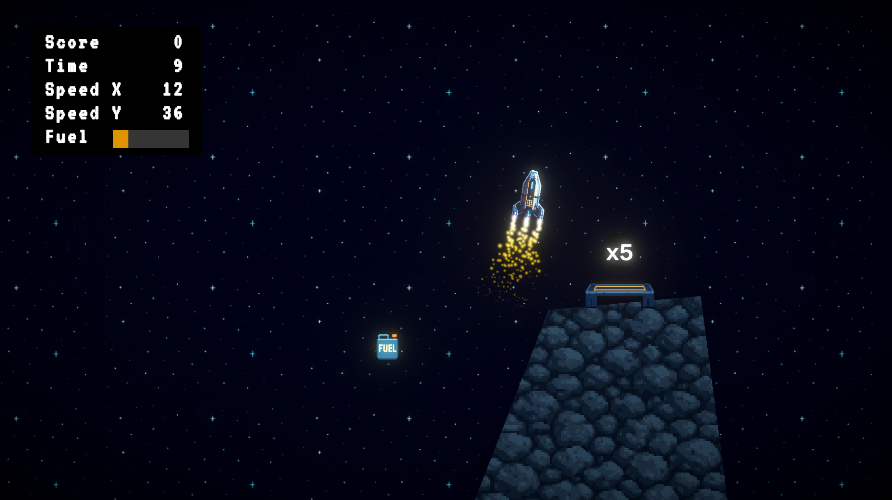
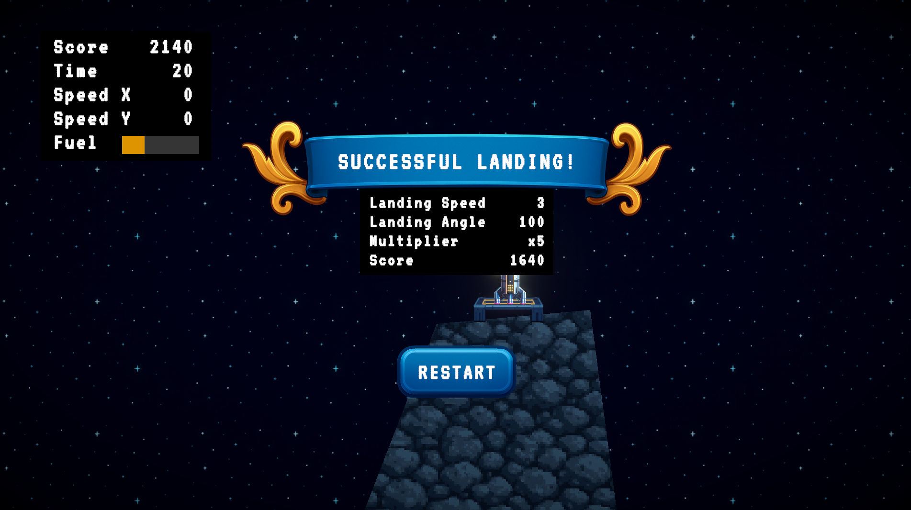
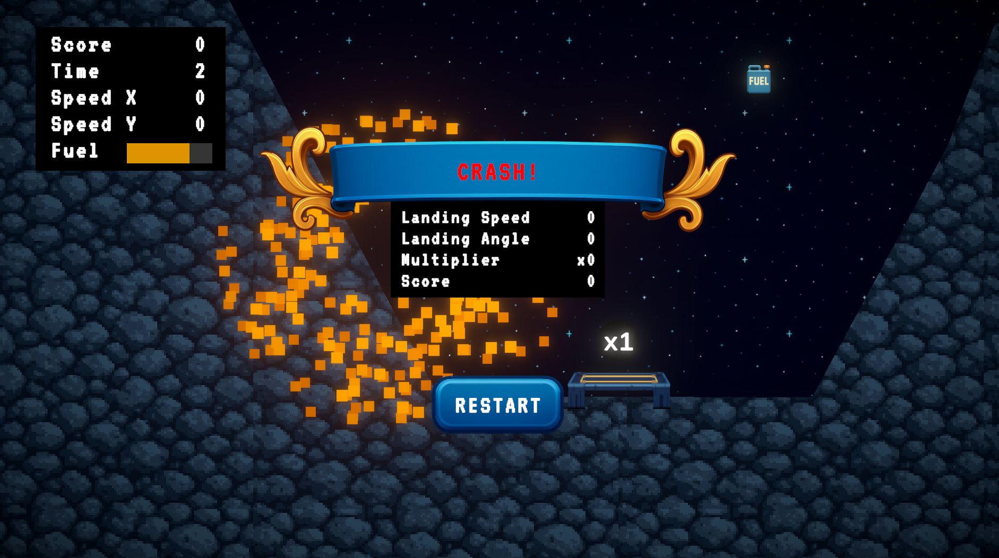

# LuaLander

LuaLander is a small 2D lander game made with Unity.

The objective is to control the lander with its thrusters, collect coins and fuel pickups, and reach a landing pad without crashing. A landing is evaluated based on the lander's speed and angle. Safer and more accurate landings award a higher score, while some landing pads provide score multipliers.

## Gameplay

- Use the upward thruster to move in the direction the lander is facing.
- Use the left and right controls to rotate the lander.
- Collect fuel pickups to restore fuel.
- Collect coins to increase the score.
- Land slowly and as upright as possible.
- Avoid hitting the terrain or landing at excessive speed or angle.
- Use higher-multiplier landing pads to earn more points.

## Controls

| Action | Key |
|---|---|
| Thrust | Up Arrow |
| Rotate Left | Left Arrow |
| Rotate Right | Right Arrow |

## Screenshots

### Gameplay

### Landing Result

### Crash Result

## Project Status

The project is still in development.

It was created as a Unity learning project by following this tutorial:

[Unity Beginner Tutorial on YouTube](https://youtu.be/nGKd4yTP3M8)

## Attribution and Licensing

This educational project was created while following [Code Monkey's Unity 2D beginner course](https://youtu.be/nGKd4yTP3M8).

My original source code and modifications are provided for educational purposes. Unity packages, fonts, tutorial assets, and other third-party materials remain subject to their respective licenses.
