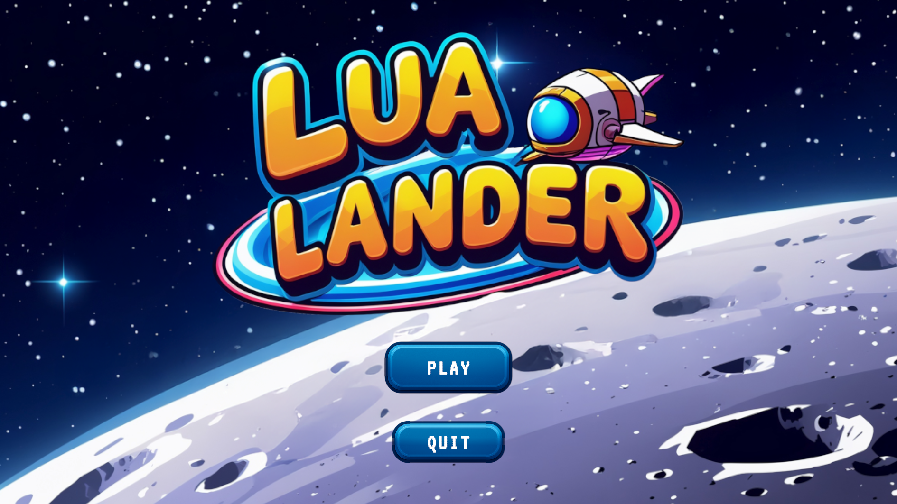
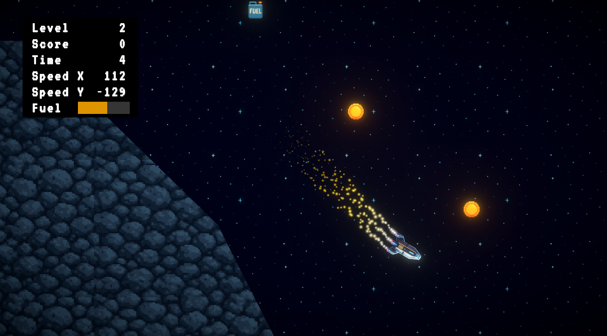
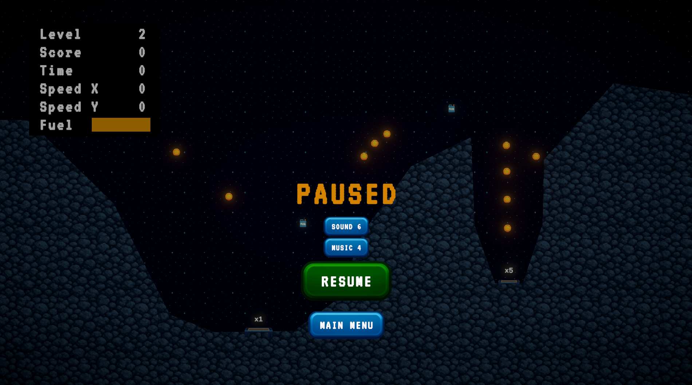

# Lua Lander

Lua Lander is a small 2D physics-based landing game made with Unity.

Control the lander with its thrusters, collect coins and fuel, and reach a landing pad without crashing. Landings are evaluated by speed and angle: safer, more accurate landings award higher scores, while smaller landing pads provide larger score multipliers.

## Features

- Physics-based thrust and rotation
- Keyboard and gamepad controls
- Multiple levels with different landing challenges
- Fuel management and collectible pickups
- Landing scores based on speed, angle, and pad multiplier
- Smooth Cinemachine level previews and camera zoom
- Main menu, pause menu, landing results, and game-over screens
- Music, thruster audio, and gameplay sound effects

## Controls

| Action | Keyboard | Gamepad |
|---|---|---|
| Thrust | `W` or Up Arrow | South button or Left Stick Up |
| Rotate Left | `A` or Left Arrow | West button or Left Stick Left |
| Rotate Right | `D` or Right Arrow | East button or Left Stick Right |
| Pause / Resume | `Esc` | Start |

## Screenshots

<table>
  <tr>
    <td align="center"><strong>Main Menu</strong> </td>
    <td align="center"><strong>Flight Gameplay</strong> </td>
    <td align="center"><strong>Pause Menu</strong> </td>
  </tr>
  <tr>
    <td align="center"><strong>Landing Approach</strong> </td>
    <td align="center"><strong>Successful Landing</strong> </td>
    <td align="center"><strong>Crash Result</strong> </td>
  </tr>
</table>

## Project Status

The tutorial project is complete.

It was created as a learning project while following:

[Code Monkey's Unity 2D beginner course](https://youtu.be/nGKd4yTP3M8)

## Attribution and Licensing

My original source code and modifications are provided for educational purposes. Unity packages, fonts, tutorial assets, and other third-party materials remain subject to their respective licenses.
